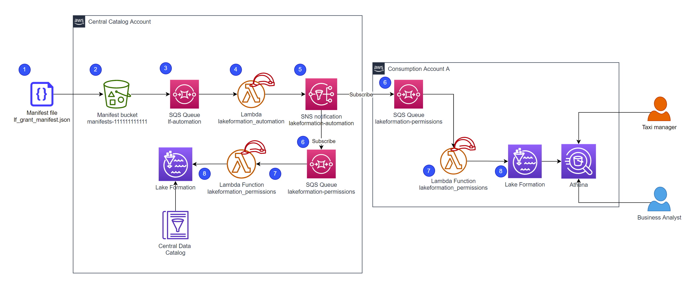

# Automating access controls in AWS Lake Formation

LakeFormation automation framework enables organizations to automate their access controls to data lakes in both single account and multi-account setups. This framework helps decrease manual processes involved in Lake Formation permission delegation. This *serverless* framework utilizes the Lake Formation API for granting and revoking permissions for a principal on a specific resource(Database, Table, columns). SNS and SQS are used to decouple cross account permissions.   

---

## Contents

* [Intended audience](#intended-audience)
* [Introduction](#introduction)
* [High-level Architecture](#high-level-architecture)
* [AWS Service Requirements](#aws-service-requirements)
    * [Central Catalog Account](#central-catalog-account)
    * [Consumption Account](#consumption-account)
* [Prerequisites](#prerequisites)
* [Deployment](#deployment)
* [Authors](#authors)
* [Contributing](#contributing)
* [License Summary](#license-summary)

---

## Intended audience

This artifact is intended for an audience who would like automate their Lake Formation access control setup process via CI/CD, without requiring users to log in as Lake Formation admins to provision permissions via the AWS console. The scope of the document also covers cross-account Lake Formation Access control automation.

## Introduction

Sharing resources (databases, tables) across accounts with central data lake and consumption account is a 2-step process

1. Share the database and (or) tables from central data lake account to a consumption account
2. In the consumption account create a resource link for shared databases and process to grant permissions on a specific resource to a specific principal

All cross-account shares from the central data lake to the consumption accounts are enabled via AWS Resource Access Manager (AWS RAM).


## High-level Architecture




1. The manifest sample file is shown below. Please replace the account number(222222222222) below with your consumption AWS account number. The manifest mentions that *lf-taxi-manager* gets SELECT access to the nyc_taxi_data table in lf_automation database, but *lf-business-analyst* get similar access except for ‘pulocationid’ and ‘dolocationid’ columns. Note: exclusion filters are used to remove permissions for the columns. you could use inclusion filters to add permissions to specific columns using ColumnNames’ key

    ```json
    {
        "Records": [{
            "AccessType": "grant",
            "Principal": "arn:aws:iam::222222222222:user/lf-taxi-manager",
            "Table": {
                "DatabaseName": "lf_automation",
                "Name": "nyc_taxi_data"
            },
            "Permissions": [
                "SELECT"
            ],
            "AccountID": "<ACCOUNT WHERE YOUR WANT THIS PERM>"
        }]
    }
    ```
2.  The user drops the manifest file into the manifest bucket(manifests-111111111111) of the Central Catalog Account that triggers the Lake Formation Automation Pipeline.

3. The manifest file creates s3 notification event and populates the `lf-automation` SQS queue

4. lf-automation SQS queue triggers the `lakeformation_automation` lambda for each incoming file, and divides the file with multiple permission blocks into separate permission requests.  

    lf-automation lambda generates account level requests i.e.

    - Database level permission request for Central catalog account that provides Cross account Lake Formation Database share to consumption account
    -  Granular level (Table, Column) permission request for Consumption account that provides data access to the consumption personas

5. Each permission request is published to the SNS topic `lakeformation-automation` as separate message

6. The lakeformation-automation SNS topic pushes SQS messages to the `lakeformation-permissions` SQS queue in the appropriate account i.e. Central Catalog account or Consumption account

7. The  `lakeformation-permissions` SQS queue triggers the `lakeformation_permissions` lambda for each incoming message.
8. The `lakeformation-permissions` lambda applies the specified permission by invoking the Lake Formation [boto3 api](https://boto3.amazonaws.com/v1/documentation/api/latest/reference/services/lakeformation.html#id23)

## AWS Service Requirements

This utility uses below AWS Services:

### Central Catalog Account

* 2 S3 buckets
* 2 Amazon SQS Queues
* 2 AWS Lambda functions
* 1 Amazon SNS Topic
* AWS Lake Formation
* AWS Glue
* Resource Access Manager

### Consumption Account (each)

* 1 S3 bucket (for Athena results)
* 1 Amazon SQS Queue
* 1 AWS Lambda function
* Athena
* AWS Lake Formation
* Resource Access Manager

## Prerequisites

-   Make sure the AWS organizations setup is complete before you start the deployment. Instructions for this are mentiond in both [*automated-deployment*](./automated-deployment/README.md) and [*blog-templates*](./blog-templates/README.md) README's

## Deployment

You can deploy this framework in an automated way or manually by cloning this repo and uploading cfn templates to cloud formation service, also make sure you follow your organizations security and devops best practices before deploying this solution to production environments.

* CLI deployment: [here](./automated-deployment/README.md)
* Console deployment: [here](./blog-templates/README.md)

## Authors

The following people are involved in the design, architecture, development, and testing of this solution:
1. **Praveen Kanumarlapudi**, Data Architect, Amazon Web Services Inc.
2. **Naveen JD**, Sr. Data Architect, Amazon Web Services Inc.
3. **Dwight Townsend**, DevOps Consultant, Amazon Web Services Inc.
4. **Lucas Hanson**, Cloud Infrastructure Architect, Amazon Web Services Inc.

## Security

See [CONTRIBUTING](CONTRIBUTING.md#security-issue-notifications) for more information.

## License

This library is licensed under the MIT-0 License. See the LICENSE file.
