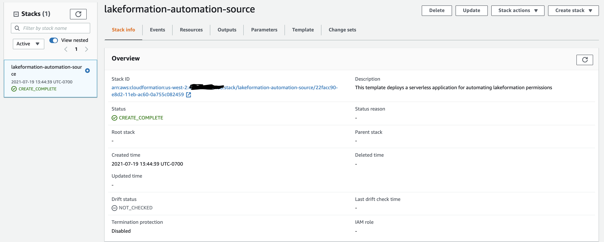
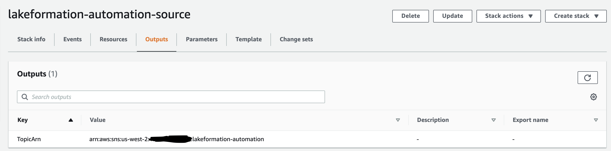
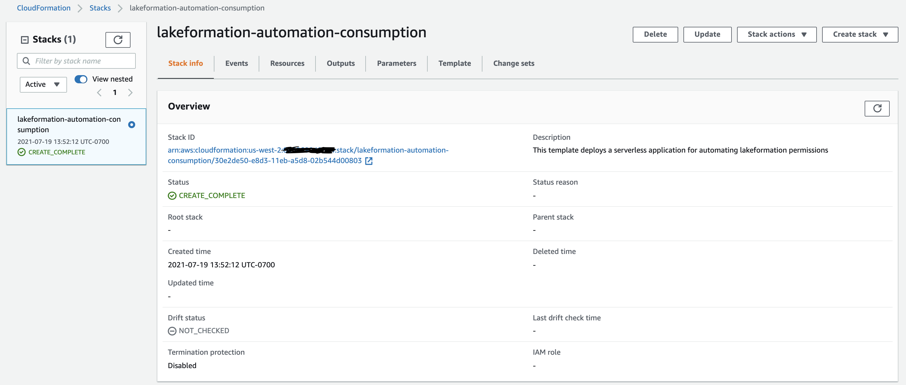

# Lakeformation Automation IaC Deployment

---

## Contents

* [prerequisites](#prerequisites)
* [Central Account](#central-account)
    * [Deployment](#deployment)
* [Consumption Account(s)](#consumption-account(s))


---

## Prerequisites
- Enable RAM Sharing via AWS Organizations: [https://docs.aws.amazon.com/ram/latest/userguide/getting-started-sharing.html#getting-started-sharing-orgs](https://docs.aws.amazon.com/ram/latest/userguide/getting-started-sharing.html#getting-started-sharing-orgs)


## Central Account
One AWS account in your organization will serve as a central account for the Lakeformation Automation infrastructure. You will need to have credentials configured in the credential chain to access this account and deploy the CloudFormation template.


### Deployment

1. Update [parameters.json](./central-account/parameters.json) with your AWS Organization ID and deployment role name.
```
[
    {
        "ParameterKey": "LFTableName",
        "ParameterValue": "nyc_taxi_data"
    },
    {
        "ParameterKey": "OrgId",
        "ParameterValue": "o-xxxxxxx" # REPLACE
    },
    {
        "ParameterKey": "LFAdmin",
        "ParameterValue": "Admin" # REPLACE
    }
]
```
2. Run the deployment script [./central-account/deploy.sh](./central-account/deploy.sh). You will need your AWS account id at a minimum.
```
> ./deploy.sh -h

    -h -- Opens up this help message
    -a -- Central Datalake AWS Account ID # required
    -n -- Name of the CloudFormation stack # optional
    -p -- Name of the AWS profile to use # optional
    -s -- Name of S3 bucket to upload artifacts to # optional
```
Example Invocation: `./deploy.sh -a 123456789876 -p central_account`

3. Confirm stack is deployed.


4. Retrieve output for SNS Topic Arn. You will need this value for deploying the consumption account stack(s).


## Consumption Account(s)
Any AWS account in your organization can serve as a consumption account for the Lakeformation Automation infrastructure. You will need to have credentials configured in the credential chain to access the account and deploy the CloudFormation template.

### Deployment

1. Update [parameters.json](./consumption-account/parameters.json) with your topic arn from the central stack deployment, central AWS account id and deployment role name.
```
[
    {
        "ParameterKey": "TopicArn",
        "ParameterValue": "arn:aws:sns:us-west-2:XXXXXXXXXXXX:lakeformation-automation" # REPLACE
    },
    {
        "ParameterKey": "CentralAccount",
        "ParameterValue": "XXXXXXXXXXXX" # REPLACE
    },
    {
        "ParameterKey": "LFAdmin",
        "ParameterValue": "Admin" # REPLACE
    }
]
```
2. Run the deployment script [deploy.sh](./consumption-account/deploy.sh). You will need your AWS account id at a minimum.
```
> ./deploy.sh -h

    -h -- Opens up this help message
    -a -- Central Datalake AWS Account ID # required
    -n -- Name of the CloudFormation stack # optional
    -p -- Name of the AWS profile to use # optional
    -s -- Name of S3 bucket to upload artifacts to # optional
```
Example Invocation: `./deploy.sh -a 123456789876 -p consumption_account`

3. Confirm stack is deployed.

