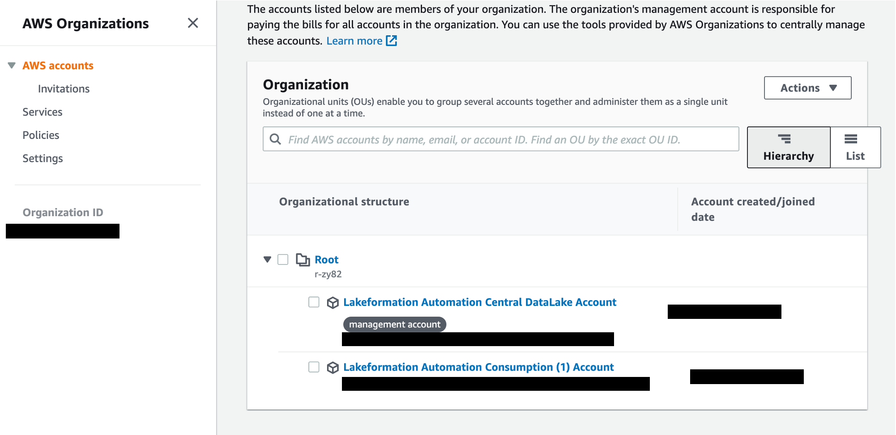
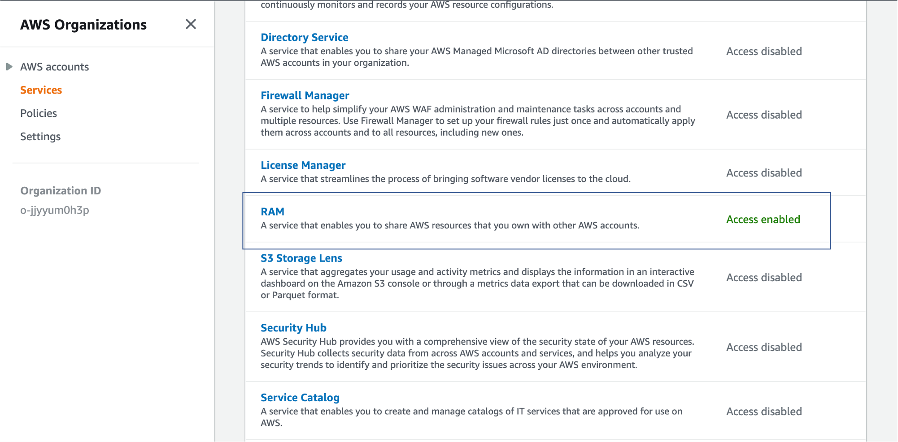
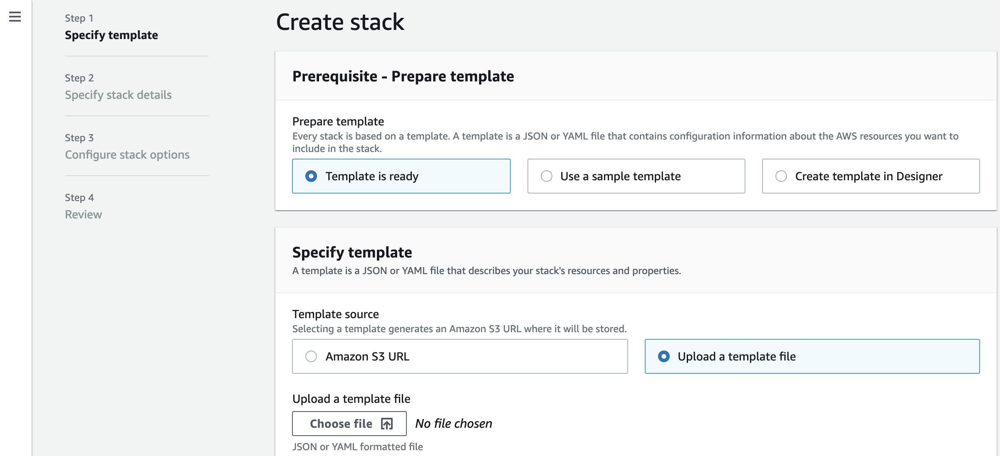
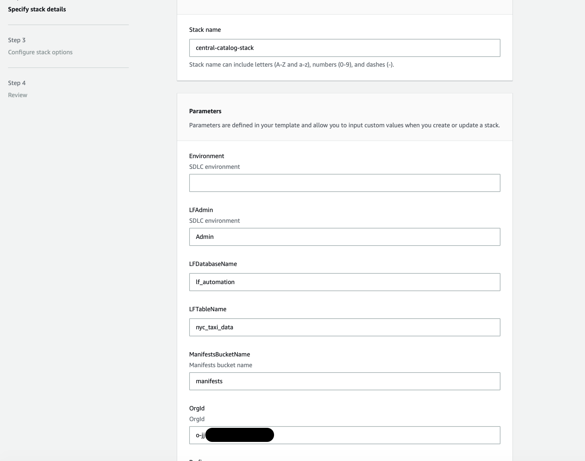
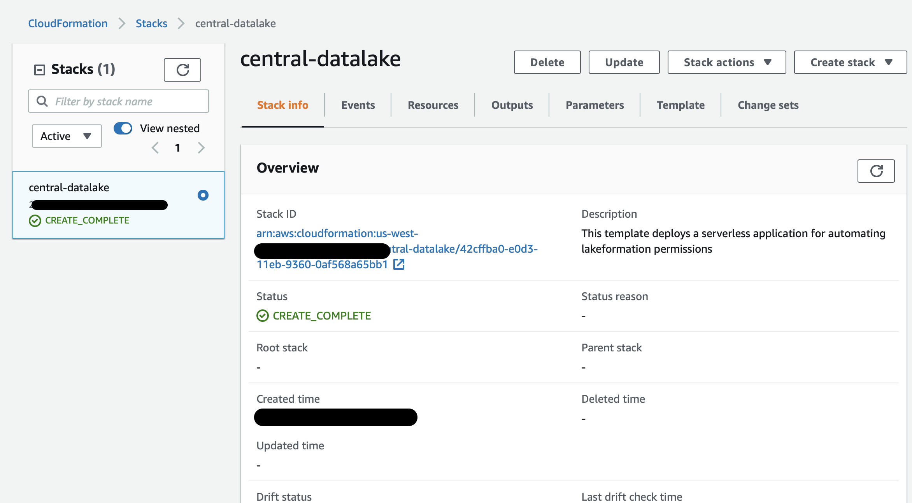
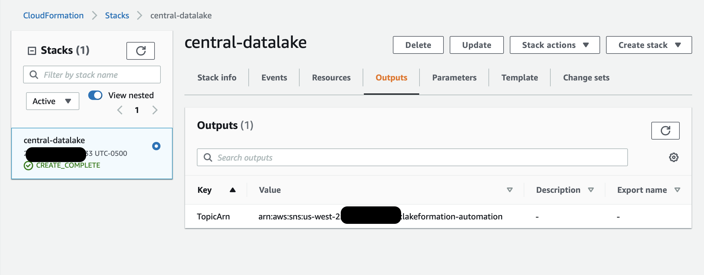
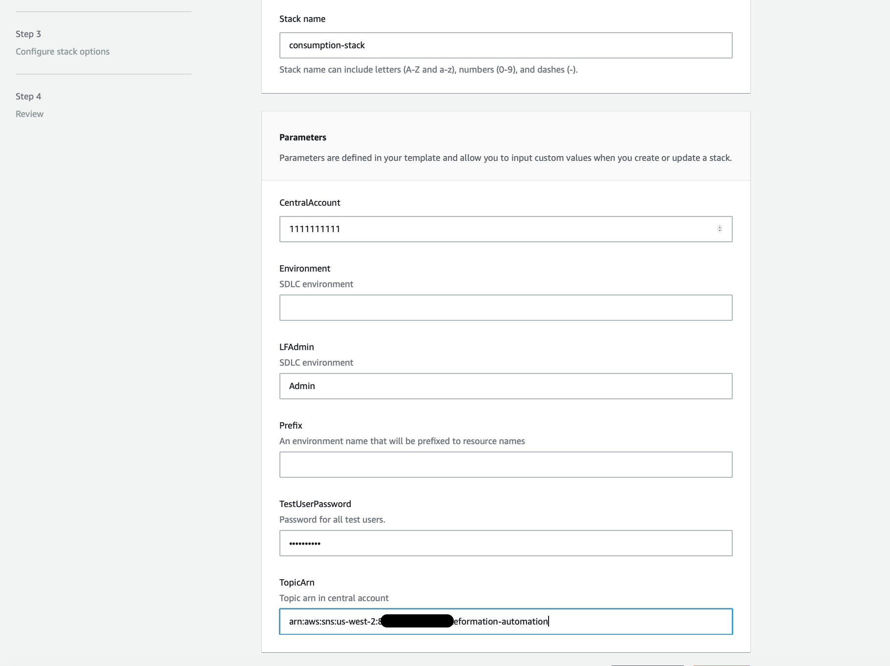

# Lakeformation Automation Setup

## prerequisites

You need the following prerequisites before you can proceed with solution:

1. Administrator access to two AWS accounts:
    * ```Central Catalog account``` - An AWS account holding the central data lake resource to share across accounts
    * ```Consumption account``` - An Aws Account with consumer roles


2. Create  an AWS account. i.e. Central Catalog Account(ex: AWS account number is 111111111111) Refer [here](https://aws.amazon.com/premiumsupport/knowledge-center/create-and-activate-aws-account/) for instructions.

3. Create AWS Organization in the Central Catalog Account and make the same as the management account. now add a member account i.e Consumption Account(ex: AWS account number is 222222222222). Refer [here](https://docs.aws.amazon.com/organizations/latest/userguide/orgs_tutorials_basic.html#tutorial-orgs-step1) for instructions. your org setup for one central catalog account and one consumption account should look like below. 

    

4. Click on services and enable trusted access for RAM service. After you have enabled RAM as a trusted service, it should look like below. 

    


## Central Catalog Account setup

1. Download the [central](/central.yaml) yaml file from the repo.

2. sign-in as Admin into *Central Catalog account*, goto *CloudFormation* -->  *click on 'Create Stack'* --> select *Upload a template file* and upload the file you downloaded from step 1 and click *'Next'*.
    

3. fill in all requried fields like *'Stack Name'*, *'OrgId'*
    * Please note only **mandatory** fields in this template are *'Stack Name'*, *'OrgId'* and Admin role name. ```OrgId``` is found in 'AWS Organizations' page, when all the prerequisites were setup. (refer prerequsites section of this page to setup AWS organizations for this framework).

      

4. click *'Next'* and wait for the stack *'CREATE_COMPLETE'*

      

5. once stack *CREATE_COMPLETE* goto output and save the sns topic arn - this is used in consumption setup.

     

After Central catalog account deployment is complete you may notice below resources have created in your Central account.
* The Data bucket and the Manifest bucket
* Copies the NY Taxi dateset(June 2021) from AWS Open data registry bucket to the Data bucket
* Glue catalog table named nyc_taxi_data in a database named lf_automation pointing to the same dataset in the Data bucket
* SQS queue to receive S3 file notifications from Manifest bucket
* Lambda function that listens to the SQS queue and create multiple message notifications
* SNS topic with a message filter based of message attributes, and deliver messages to other accounts 
* SQS queue to receive SNS notifications
* Lambda function that listens to the SQS queue and sets the DB level Lake formation permissions


## Consumption Account setup

1. Download the [consumption](/consumption.yaml) yaml file from the repo.

2. sign-in as Admin to your Consumption Account,goto *CloudFormation* -->  *click on 'Create Stack'* --> select *Upload a template file* and upload the file you downloaded from step 1 and click *'Next'*.

3. fill in all requried fields *CentralAccount* - Account number of central catalog account, 
*TopicArn* - Copied from output of Central catalog accout CloudFormation stack

    

4. click *'Next'* and wait for the stack *'CREATE_COMPLETE'*

After Consumption deployment is complete you may notice below resources have created in your Central account.

* SQS queue to receive SNS notifications from Central catalog account
* Lambda function that listens to the SQS queue and sets the DB or table or column level Lake formation permissions
* Two consumption users (lf-taxi-manager and lf-business-analyst).
* Athena resource access to the consumption users